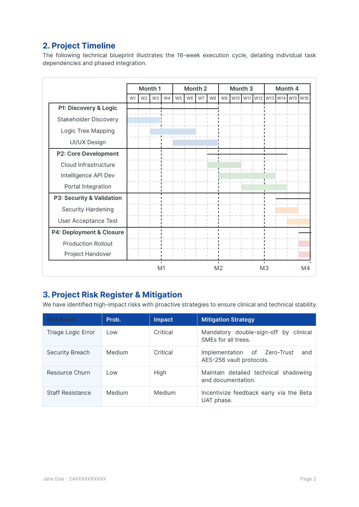
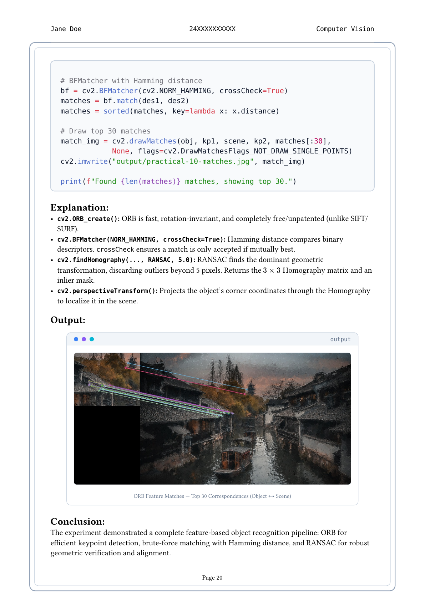
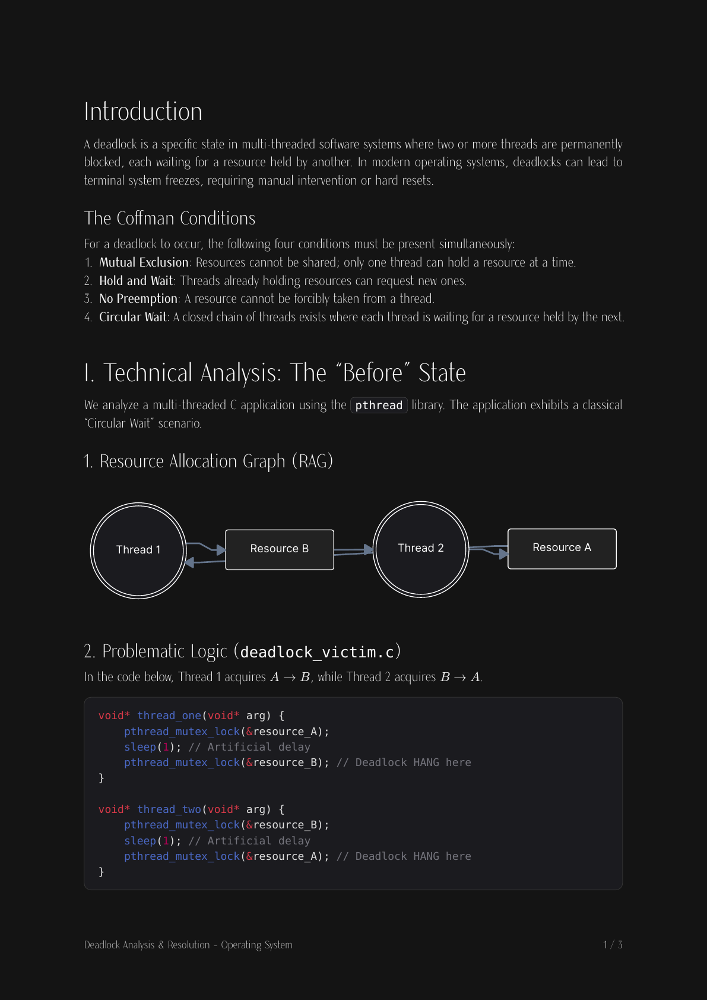
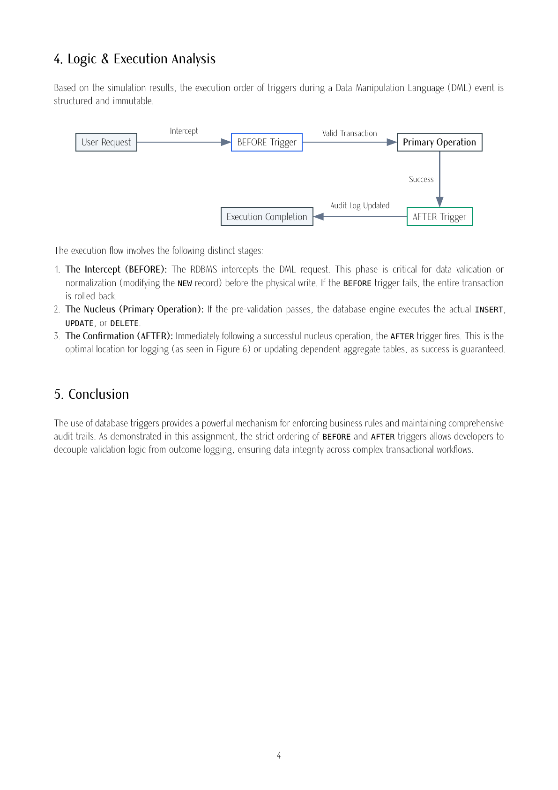

# Assignments and Lab Manuals

[](LICENSE-MIT)
[](LICENSE-CC)

This repository contains a collection of Active Learning Assessments (ALAs) and comprehensive lab manuals typeset using [Typst](https://typst.app/), the modern and fast markup-based typesetting system.

The documents in this repository represent coursework, lab experiments, and evaluations organized by academic semester.

## Showcase

| **Dark Minimalist Cover** | **Warm Editorial Specification** |
| :---: | :---: |
| [](samples/dark_cover_minimal.png) | [](samples/srs_warm_editorial.png) |
| *Editorial cover layout with bold typography & dark theme ([SE ALA-1](sem-5/ala/se/ala-1))* | *Requirements specification with warm orange theme & priority badges ([SE ALA-1](sem-5/ala/se/ala-1))* |

| **Algorithmic Complexity Matrix** | **AI Presentation Slide Deck** |
| :---: | :---: |
| [](samples/algo_complexity_cheatsheet.png) | [](samples/ai_lidar_presentation.png) |
| *Dense landscape cheatsheet with color-coded Big-O metrics ([ADA Revision](sem-5/revision))* | *16:9 Diatypst presentation slide with 3D LiDAR point cloud visualization ([AI ALA-1](sem-5/ala/ai))* |

| **Network Topology & Systems Architecture** | **Data Compression Theory & Mindmap** |
| :---: | :---: |
| [](samples/network_topology_roas.png) | [](samples/compression_taxonomy.png) |
| *Cisco Packet Tracer Router-on-a-Stick VLAN topology diagram ([CN ALA-2](sem-5/ala/cn))* | *Taxonomy mindmap and variable-length bitstream compression analysis ([ADA Report](sem-5/ala/ada))* |

| **Classic Academic Lab Manual** | **Photographic Practical Guide** |
| :---: | :---: |
| [](samples/academic_lab_practical.png) | [](samples/hardware_cabling_guide.png) |
| *Formal framed academic manual with hybrid topology diagram & table ([CN Lab](sem-5/lab-manual/cn))* | *Step-by-step photographic RJ-45 crimping & continuity testing sequence ([CN Lab](sem-5/lab-manual/cn))* |

| **Project Timeline & Gantt Blueprint** | **Computer Vision Feature Matching** |
| :---: | :---: |
| [](samples/project_timeline_gantt.png) | [](samples/cv_feature_matching.png) |
| *16-week phased Gantt schedule with milestone tracking & risk register ([Python ALA](sem-4/ala/python))* | *ORB keypoint correspondence, RANSAC homography, & macOS window framing ([CV Lab](sem-4/lab-manual/cv))* |

| **Concurrency & Deadlock RAG** | **Database Trigger Execution Flow** |
| :---: | :---: |
| [](samples/os_deadlock_rag.png) | [](samples/dbms_trigger_flowchart.png) |
| *Dark-mode multi-threaded deadlock analysis with Coffman criteria & Mermaid RAG graph ([OS ALA](sem-4/ala/os))* | *DML trigger intercept and validation sequence diagram typeset with Fletcher ([DBMS ALA](sem-4/ala/dbms))* |

## Structure

The repository is organized by semester and subject:

```text
typst-docs/
├── sem-4/
│   ├── ala/
│   │   ├── cle/          # Cyber Law & Ethics (CLE) - ALAs, Policy Comparisons, Gap Analysis, & Interview Prep
│   │   ├── dbms/         # Database Management Systems (DBMS) - Normalization & Triggers
│   │   ├── os/           # Operating Systems (OS) - Deadlock Assignments, Scheduling, & Thread/Process Creation
│   │   └── python/       # Python - Project Scope, Blueprints, Proposals, & Execution Reports
│   └── lab-manual/
│       ├── cv/           # Computer Vision (CV) - Comprehensive Lab Manual, ALAs, & Nix devenv (Python/uv)
│       └── os/           # Operating Systems (OS) - Lab Manual & Systems Programming Practicals
├── sem-5/
│   ├── ala/
│   │   ├── ada/          # Analysis and Design of Algorithms (ADA) - Sorting Analysis & Huffman Coding Report
│   │   ├── ai/           # Artificial Intelligence (AI) - Autonomous Vehicles & Real-World AI Slides
│   │   ├── cn/           # Computer Networks (CN) - Topology Design & Packet Rescue (VLAN Configuration)
│   │   └── se/           # Software Engineering (SE) - PulseFeed SRS/UML (ALA-1) & COCOMO Estimation (ALA-2)
│   ├── lab-manual/
│   │   ├── cn/           # Computer Networks (CN) - Comprehensive Lab Manual (Cabling, Commands, Wireshark)
│   │   └── se/           # Software Engineering (SE) - Lab Manual (SDLC Models, SRS, UML, & Testing)
│   └── revision/         # Revision Materials - ADA Complexities Cheatsheet & CN 5-Unit Study Guide
├── internship/           # Summer Internship 2026 Documentation & Templates
│   ├── original/         # Official university internship guidelines & source templates (.docx, .pdf)
│   └── template/
│       ├── original/     # 1:1 Typst translation of the official university report template
│       └── fixed/        # Typographically refined template with grammar fixes, styling, & clean pagination
├── misc/                 # Miscellaneous academic materials and metadata (e.g., student metadata)
└── old/                  # Legacy/Archived documents (Heat Transfer, older OS Lab Manuals)
```

### Course Breakdown

| Semester / Path | Subject | Key Topics / Content | Format & Source Files |
| :--- | :--- | :--- | :--- |
| **`sem-4/ala/cle`** | **Cyber Law & Ethics** | Policy comparison, gap analysis, ethics policy, presentation slides, interview prep | `.typ`, `.png` |
| **`sem-4/ala/dbms`** | **DBMS** | Normalization steps, triggers in DBMS, audit logs | `.typ`, `.pdf`, `.png` |
| **`sem-4/ala/os`** | **Operating Systems** | Deadlock assignment, process scheduling algorithms, process & thread creation | `.typ`, `.pdf` |
| **`sem-4/ala/python`** | **Python Programming** | Project scope plan, detailed project plan, execution report, proposal | `.typ`, `.pdf`, `.png` |
| **`sem-4/lab-manual/cv`** | **Computer Vision** | CV lab experiments, assignment ALAs, Python scripts, reproducible Nix dev shell | `.typ`, `.py`, `.nix`, `.toml` |
| **`sem-4/lab-manual/os`** | **Operating Systems** | Linux systems programming experiments, practical bash execution scripts | `.typ`, `.sh`, `.pdf` |
| **`sem-5/ala/ada`** | **ADA** | Sorting algorithms comparative analysis, Huffman coding & compression theory, benchmark visualizers | `.typ`, `.pdf`, `.png`, `.svg` |
| **`sem-5/ala/ai`** | **Artificial Intelligence** | Real-world AI applications, autonomous vehicle perception & sensor architectures | `.typ`, `.pdf`, `.jpg` |
| **`sem-5/ala/cn`** | **Computer Networks** | Network topology design with CeTZ, Cisco Packet Tracer VLAN configuration & rescue | `.typ`, `.pdf`, `.svg` |
| **`sem-5/ala/se`** | **Software Engineering** | UML blueprints for PulseFeed content discovery engine (ALA-1); COCOMO model software sizing & cost estimation (ALA-2) | `.typ`, `.pdf`, `.svg` |
| **`sem-5/lab-manual/cn`** | **Computer Networks** | Network cabling/crimping, CLI utilities, OSI/TCP-IP models, Wireshark packet capture & protocol analysis | `.typ`, `.pdf`, `.png`, `.svg`, `.jpg` |
| **`sem-5/lab-manual/se`** | **Software Engineering** | SDLC models, SRS documentation, comprehensive UML suite, testing methodologies & bug reports | `.typ`, `.pdf`, `.py`, `.md` |
| **`sem-5/revision`** | **ADA & CN Revision** | Fast-lookup ADA algorithmic complexity cheatsheet; comprehensive 5-unit Computer Networks revision handbook with network diagrams | `.typ`, `.pdf`, `.png`, `.jpg` |
| **`internship/`** | **Summer Internship** | Official university guidelines & templates: 1:1 Typst translation and enhanced typographical edition with grammar fixes | `.typ`, `.pdf`, `.docx`, `.png` |
| **`misc/`** | **Metadata & Config** | Centralized student metadata (`metadata.json`) referenced across coursework documents | `.json` |
| **`old/`** | **Legacy Archives** | Heat Transfer coursework, legacy OS lab practicals | `.typ`, `.pdf`, `.svg` |


## Workflows

### Compiling Typst Documents

To view or build the final PDF documents, you will need the [Typst CLI](https://typst.app/) installed. You can compile any `.typ` source file directly to a PDF:

```bash
# Compile a specific document to PDF
typst compile path/to/document.typ

# Compile documents referencing repository-root assets or metadata (e.g., misc/metadata.json)
typst compile --root . path/to/document.typ

# Compile and automatically watch for modifications (auto-recompiles on save)
typst watch path/to/document.typ
```

### Nix Tooling & Utilities

For external dependencies or utilities not installed on the base system, use Nix:

```bash
# Render PDF pages to high-resolution PNGs via Poppler
nix shell nixpkgs#poppler-utils -c pdftoppm -png -r 144 path/to/document.pdf output
```

### Nix Development Environment (`devenv`)

For environments with external dependencies such as OpenCV and Python in `sem-4/lab-manual/cv/`, a fully reproducible Nix developer shell is configured using [devenv](https://devenv.sh/). It provisions dependencies such as:

- **Python** with `uv` for package management.
- **Pandoc** for document format transformations.
- System libraries like `libGL`, `libxcb`, `zbar`, and more for image processing.

To enter the shell in `sem-4/lab-manual/cv/`, run:

```bash
cd sem-4/lab-manual/cv
devenv shell
```

## License

This repository is dual-licensed based on content type:

- **Code, Scripts & Typst Templates**: Licensed under the [MIT License](LICENSE-MIT). You are free to adapt the Typst layouts, macros, and helper scripts in your own projects.
- **Academic Content, Manuals & Media**: Licensed under the [Creative Commons Attribution-NonCommercial-ShareAlike 4.0 International License (CC BY-NC-SA 4.0)](LICENSE-CC).

For full details, please refer to the master [LICENSE](LICENSE) file.

## Academic Integrity

The documents provided in this repository reflect personal coursework, laboratory submissions, and study materials. They are made publicly available for self-study, reference, and typesetting inspiration. Please adhere to your institution's academic integrity policies and honor codes regarding coursework plagiarism.
