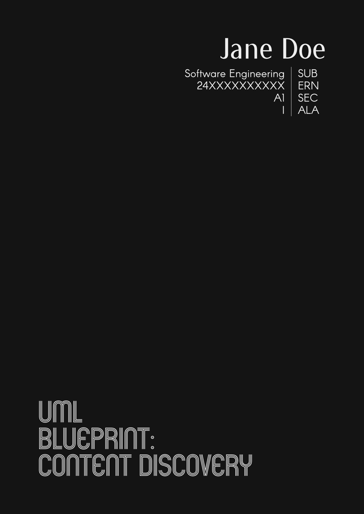
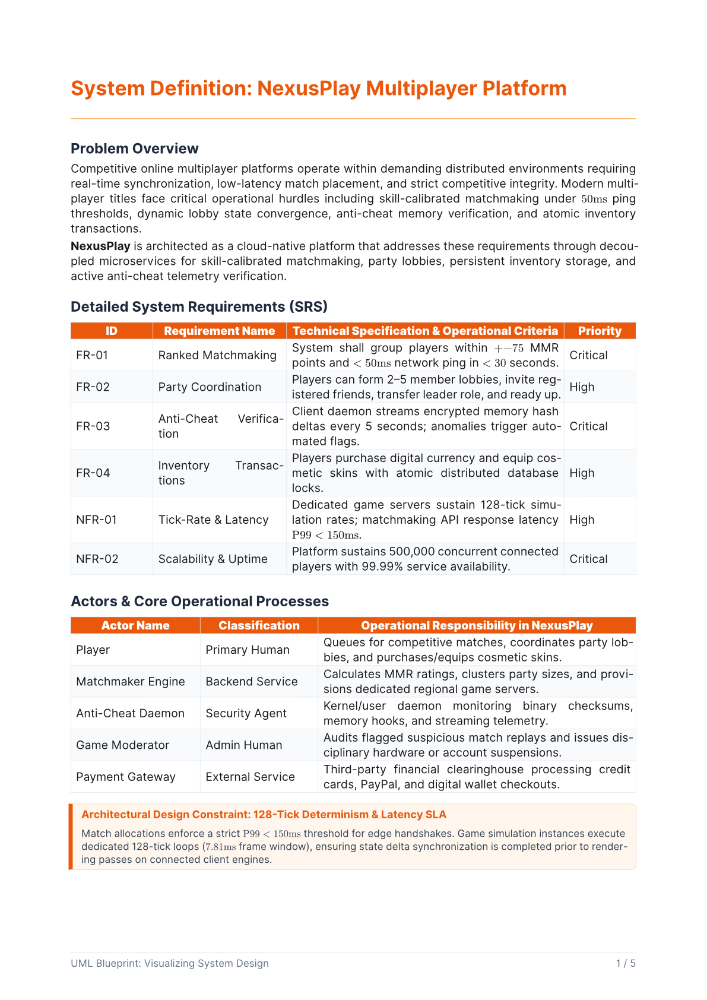
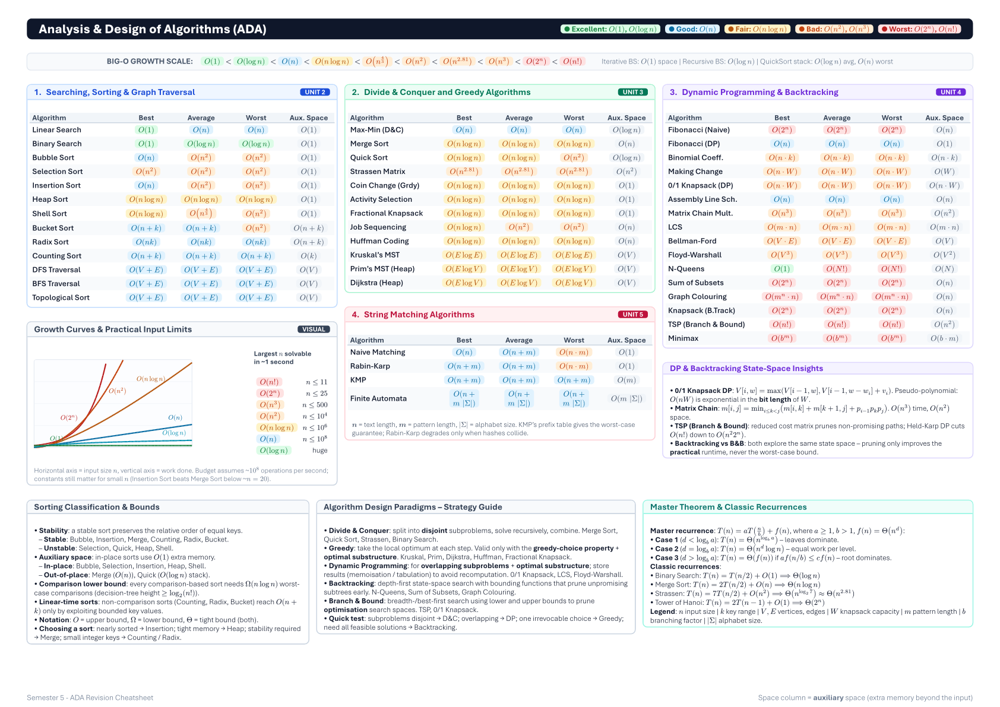
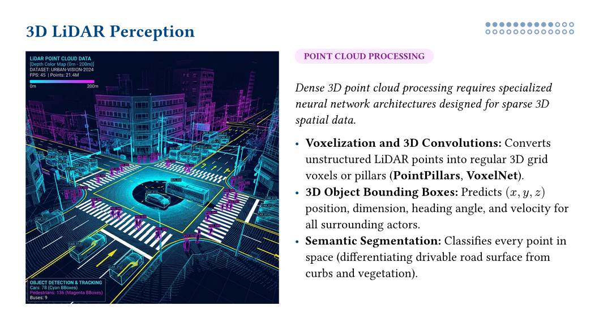
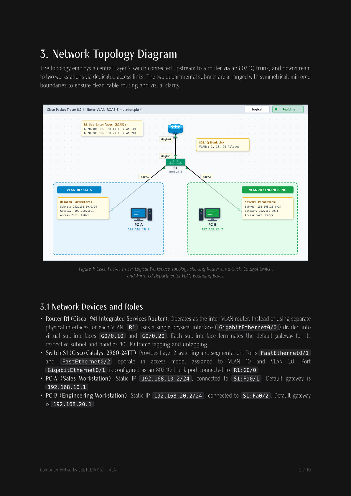
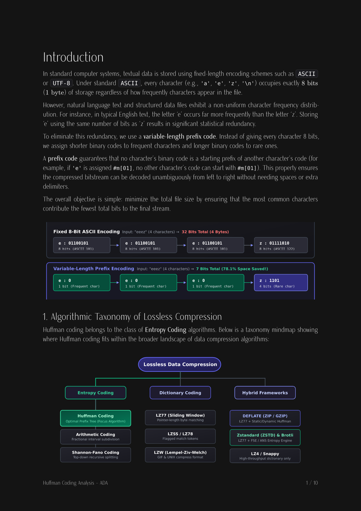
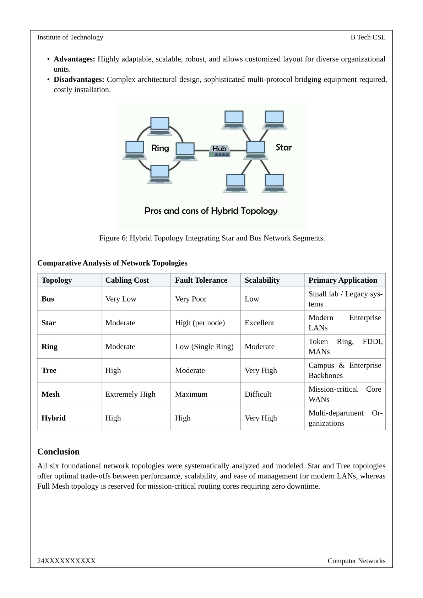
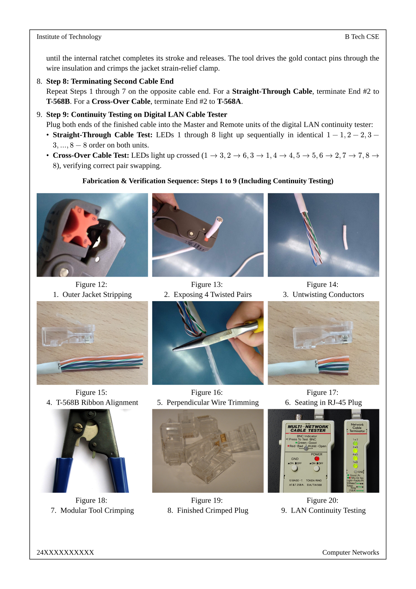

# Assignments and Lab Manuals

This repository contains a collection of Active Learning Assessments (ALAs) and comprehensive lab manuals typeset using [Typst](https://typst.app/), the modern and fast markup-based typesetting system.

The documents in this repository represent coursework, lab experiments, and evaluations organized by academic semester.

## Showcase

| **Dark Minimalist Cover** | **Warm Editorial Specification** |
| :---: | :---: |
| [](samples/dark_cover_minimal.png) | [](samples/srs_warm_editorial.png) |
| *Editorial cover layout with bold typography & dark theme ([SE ALA-1](sem-5/ala/se/ala-1))* | *Requirements specification with warm orange theme & priority badges ([SE ALA-1](sem-5/ala/se/ala-1))* |

| **Algorithmic Complexity Matrix** | **AI Presentation Slide Deck** |
| :---: | :---: |
| [](samples/algo_complexity_cheatsheet.png) | [](samples/ai_lidar_presentation.png) |
| *Dense landscape cheatsheet with color-coded Big-O metrics ([ADA Revision](sem-5/revision))* | *16:9 Diatypst presentation slide with 3D LiDAR point cloud visualization ([AI ALA-1](sem-5/ala/ai))* |

| **Network Topology & Systems Architecture** | **Data Compression Theory & Mindmap** |
| :---: | :---: |
| [](samples/network_topology_roas.png) | [](samples/compression_taxonomy.png) |
| *Cisco Packet Tracer Router-on-a-Stick VLAN topology diagram ([CN ALA-2](sem-5/ala/cn))* | *Taxonomy mindmap and variable-length bitstream compression analysis ([ADA Report](sem-5/ala/ada))* |

| **Classic Academic Lab Manual** | **Photographic Practical Guide** |
| :---: | :---: |
| [](samples/academic_lab_practical.png) | [](samples/hardware_cabling_guide.png) |
| *Formal framed academic manual with hybrid topology diagram & table ([CN Lab](sem-5/lab-manual/cn))* | *Step-by-step photographic RJ-45 crimping & continuity testing sequence ([CN Lab](sem-5/lab-manual/cn))* |

## Structure

The repository is organized by semester and subject:

```text
typst-docs/
├── sem-4/
│   ├── ala/
│   │   ├── cle/          # Cyber Law & Ethics (CLE) - ALAs, Policy Comparisons, Gap Analysis, & Interview Prep
│   │   ├── dbms/         # Database Management Systems (DBMS) - Normalization & Triggers
│   │   ├── os/           # Operating Systems (OS) - Deadlock Assignments, Scheduling, & Thread/Process Creation
│   │   └── python/       # Python - Project Scope, Blueprints, Proposals, & Execution Reports
│   └── lab-manual/
│       ├── cv/           # Computer Vision (CV) - Comprehensive Lab Manual, ALAs, & Nix devenv (Python/uv)
│       └── os/           # Operating Systems (OS) - Lab Manual & Systems Programming Practicals
├── sem-5/
│   ├── ala/
│   │   ├── ada/          # Analysis and Design of Algorithms (ADA) - Sorting Analysis & Huffman Coding Report
│   │   ├── ai/           # Artificial Intelligence (AI) - Autonomous Vehicles & Real-World AI Slides
│   │   ├── cn/           # Computer Networks (CN) - Topology Design & Packet Rescue (VLAN Configuration)
│   │   └── se/           # Software Engineering (SE) - UML Blueprints (PulseFeed Content Discovery Engine)
│   ├── lab-manual/
│   │   ├── cn/           # Computer Networks (CN) - Comprehensive Lab Manual (Cabling, Commands, Wireshark)
│   │   └── se/           # Software Engineering (SE) - Lab Manual (SDLC Models, SRS, UML, & Testing)
│   └── revision/         # Revision Materials - ADA Time & Space Complexity Cheatsheet
├── misc/                 # Miscellaneous academic materials and metadata (e.g., student metadata)
└── old/                  # Legacy/Archived documents (Heat Transfer, older OS Lab Manuals)
```

### Course Breakdown

| Semester / Path | Subject | Key Topics / Content | Format & Source Files |
| :--- | :--- | :--- | :--- |
| **`sem-4/ala/cle`** | **Cyber Law & Ethics** | Policy comparison, gap analysis, ethics policy, presentation slides, interview prep | `.typ`, `.png` |
| **`sem-4/ala/dbms`** | **DBMS** | Normalization steps, triggers in DBMS, audit logs | `.typ`, `.pdf`, `.png` |
| **`sem-4/ala/os`** | **Operating Systems** | Deadlock assignment, process scheduling algorithms, process & thread creation | `.typ`, `.pdf` |
| **`sem-4/ala/python`** | **Python Programming** | Project scope plan, detailed project plan, execution report, proposal | `.typ`, `.pdf`, `.png` |
| **`sem-4/lab-manual/cv`** | **Computer Vision** | CV lab experiments, assignment ALAs, Python scripts, reproducible Nix dev shell | `.typ`, `.py`, `.nix`, `.toml` |
| **`sem-4/lab-manual/os`** | **Operating Systems** | Linux systems programming experiments, practical bash execution scripts | `.typ`, `.sh`, `.pdf` |
| **`sem-5/ala/ada`** | **ADA** | Sorting algorithms comparative analysis, Huffman coding & compression theory, benchmark visualizers | `.typ`, `.pdf`, `.png`, `.svg` |
| **`sem-5/ala/ai`** | **Artificial Intelligence** | Real-world AI applications, autonomous vehicle perception & sensor architectures | `.typ`, `.pdf`, `.jpg` |
| **`sem-5/ala/cn`** | **Computer Networks** | Network topology design with CeTZ, Cisco Packet Tracer VLAN configuration & rescue | `.typ`, `.pdf`, `.svg` |
| **`sem-5/ala/se`** | **Software Engineering** | UML blueprints for content discovery engine (SRS, use case, class, sequence, state machine) | `.typ`, `.pdf`, `.svg` |
| **`sem-5/lab-manual/cn`** | **Computer Networks** | Network cabling/crimping, CLI utilities, OSI/TCP-IP models, Wireshark packet capture & protocol analysis | `.typ`, `.pdf`, `.png`, `.svg`, `.jpg` |
| **`sem-5/lab-manual/se`** | **Software Engineering** | SDLC models, SRS documentation, comprehensive UML suite, testing methodologies & bug reports | `.typ`, `.pdf`, `.py`, `.md` |
| **`sem-5/revision`** | **ADA Revision** | Fast-lookup revision cheatsheet for algorithmic time and auxiliary space complexities | `.typ`, `.pdf` |
| **`old/`** | **Legacy Archives** | Heat Transfer coursework, legacy OS lab practicals | `.typ`, `.pdf`, `.svg` |


## Workflows

### Compiling Typst Documents

To view or build the final PDF documents, you will need the [Typst CLI](https://typst.app/) installed. You can compile any `.typ` source file directly to a PDF:

```bash
# Compile a specific document to PDF
typst compile path/to/document.typ

# Compile and automatically watch for modifications (auto-recompiles on save)
typst watch path/to/document.typ
```

### Nix Development Environment (`devenv`)

For environments with external dependencies such as OpenCV and Python in `sem-4/lab-manual/cv/`, a fully reproducible Nix developer shell is configured using [devenv](https://devenv.sh/). It provisions dependencies such as:

- **Python** with `uv` for package management.
- **Pandoc** for document format transformations.
- System libraries like `libGL`, `libxcb`, `zbar`, and more for image processing.

To enter the shell in `sem-4/lab-manual/cv/`, run:

```bash
cd sem-4/lab-manual/cv
devenv shell
```
